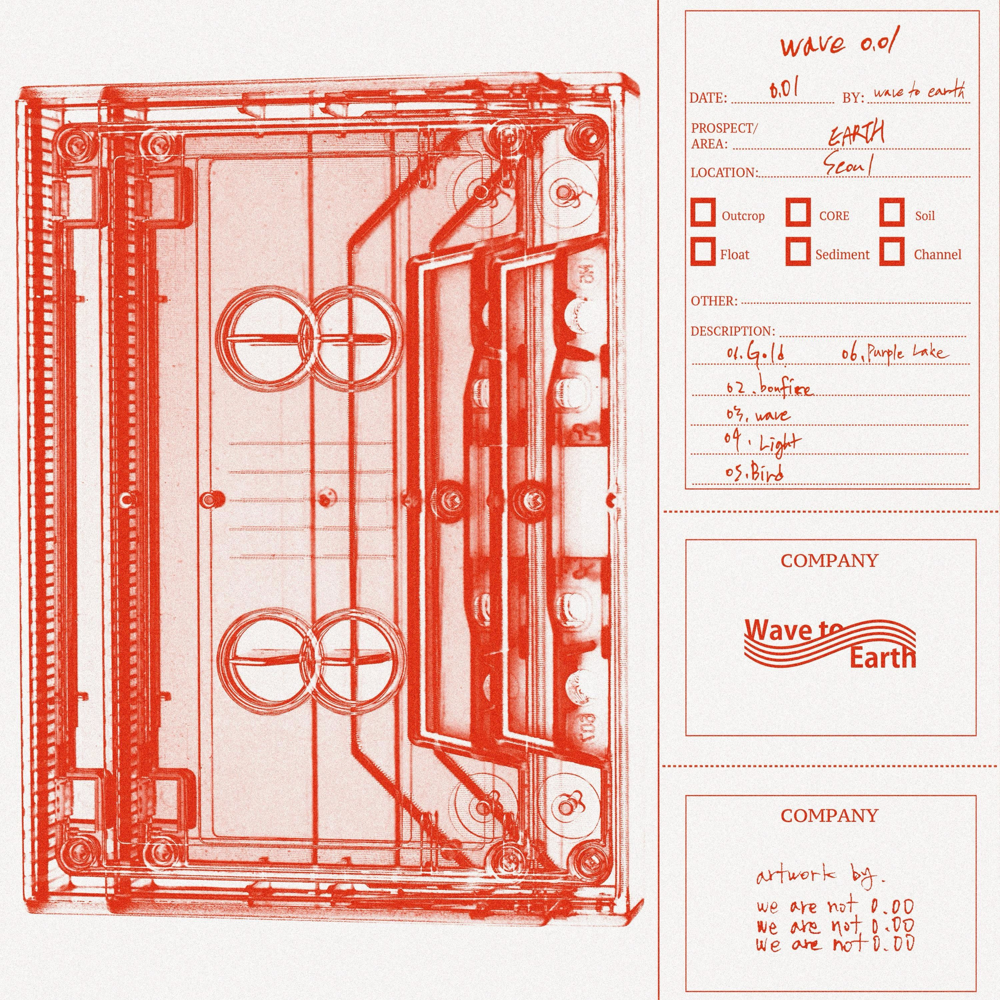
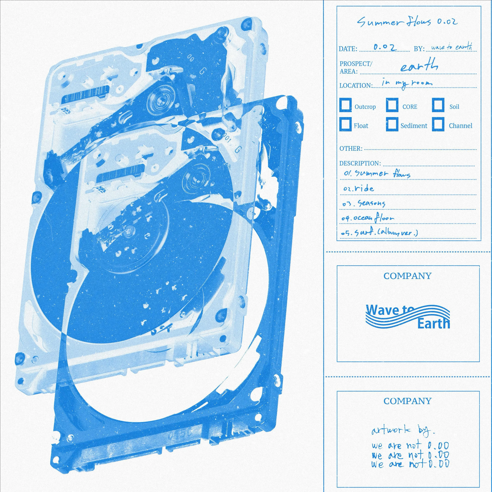
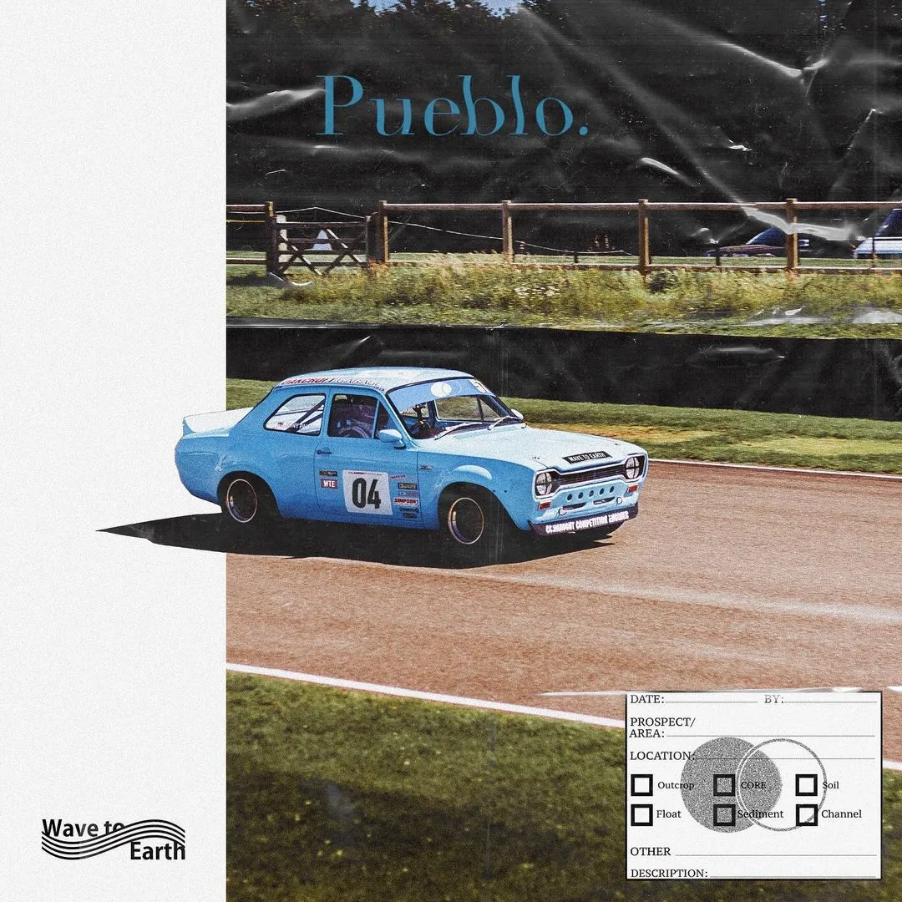
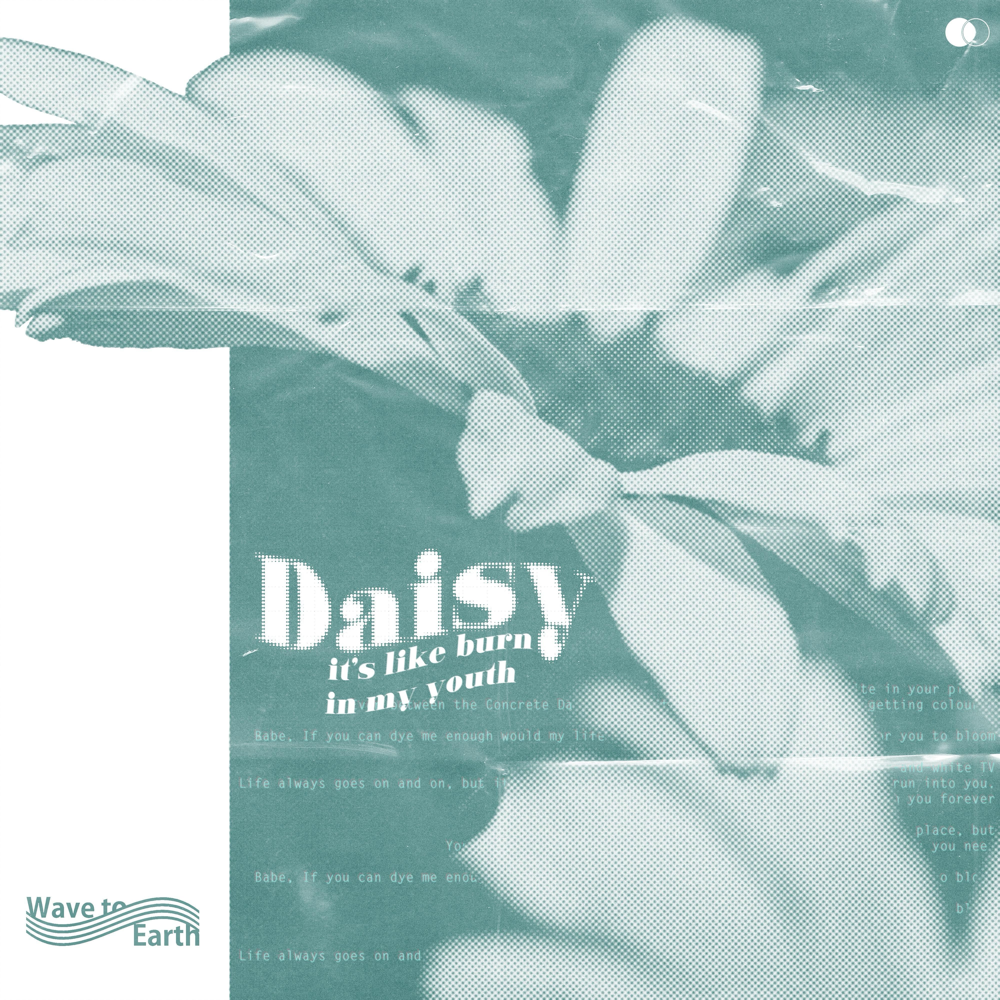
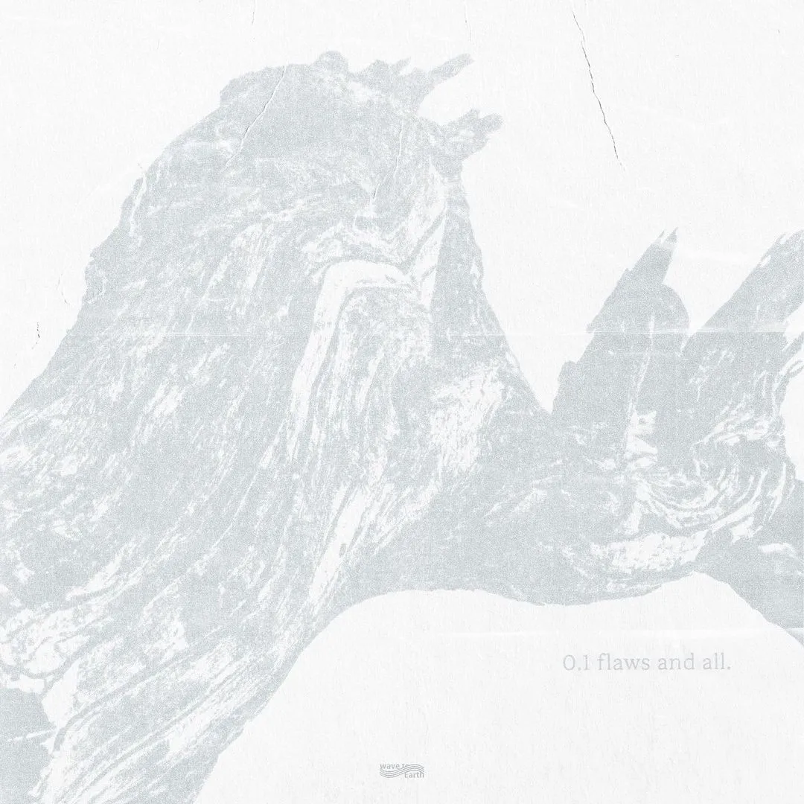
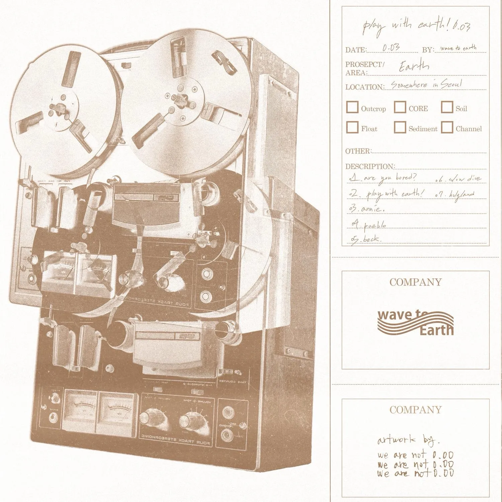
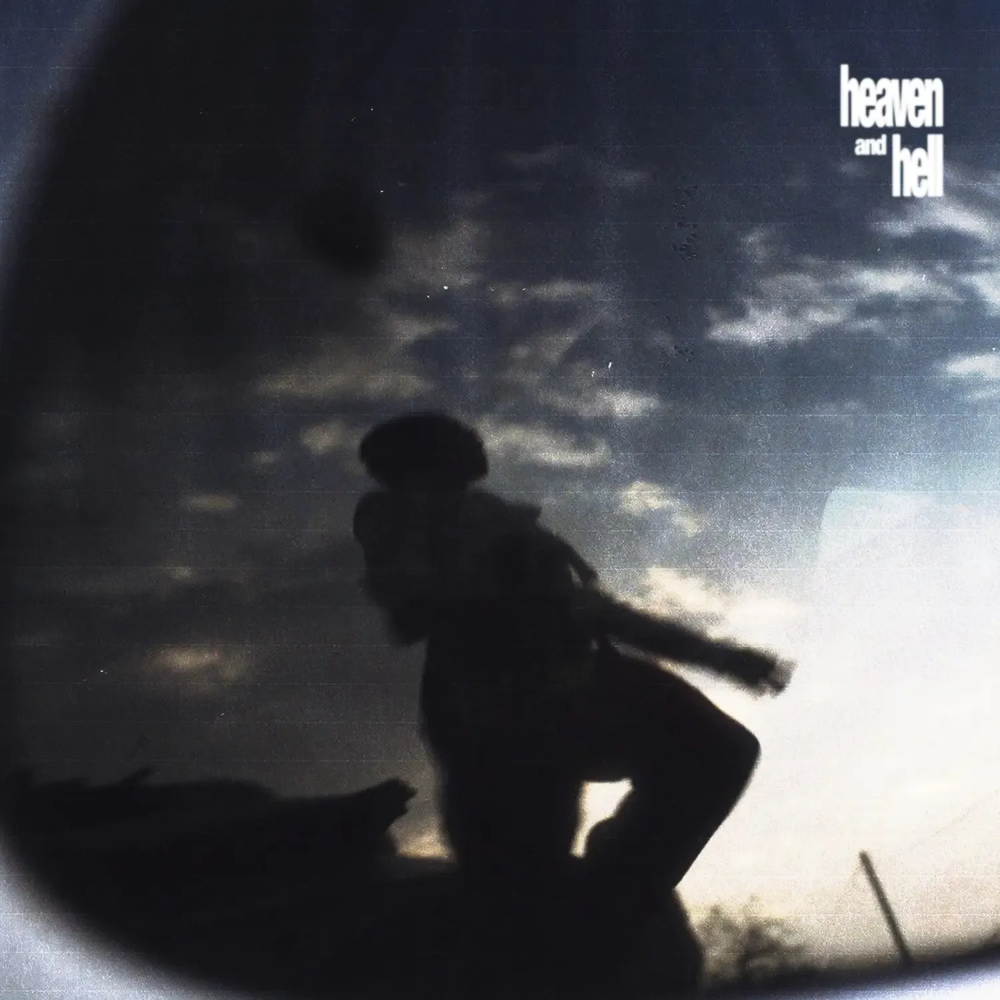

- ## wave to earth  

  <a href="WTE ARCHIVE/ECHOES/Behind the Song/WTE/wave 0.01" class="album-card" style="--album-bg: #fdf2e9;">
   

    

   

    wave 0.01
    2020.01.02
   

  </a>
  <a href="WTE ARCHIVE/ECHOES/Behind the Song/WTE/summer flows 0.02" class="album-card" style="--album-bg: #fdf2e9;">
   

    

   

    summer flows 0.02
    2020.08.04
   

  </a>
  <a href="WTE ARCHIVE/ECHOES/Behind the Song/WTE/play with earth! 0.03#04. pueblo (remastered 2024)" class="album-card" style="--album-bg: #dcedf9;">
  

    

  

    pueblo
    2020.12.03
  

</a>
<a href="WTE ARCHIVE/ECHOES/Behind the Song/WTE/daisy." class="album-card" style="--album-bg: #dcedf9;">
  

    
  

  

    daisy.
    2021.05.13
  

</a>
  <a href="WTE ARCHIVE/ECHOES/Behind the Song/WTE/0.1 flaws and all." class="album-card" style="--album-bg: #fdf2e9;">
   

    

   

    0.1 flaws and all.
    2023.04.20
   

  </a>
  <a href="WTE ARCHIVE/ECHOES/Behind the Song/WTE/play with earth! 0.03" class="album-card" style="--album-bg: #fdf2e9;">
   

    

   

    play with earth! 0.03
    2024.09.06
   

</a>
<a href="WTE ARCHIVE/ECHOES/Behind the Song/WTE/bad pieces#01 heaven and hell" class="album-card" style="--album-bg: #d5e8f6;">
   

    

   

    heaven and hell
    2026.05.15
   

</a>

  
 
   

### <u>***✧封面视觉概念***</u>  

**在制作首张EP时，Seungki提出围绕“存储”这一概念来进行专辑视觉设计，即各种形式的存储载体。**  
**“专辑捕捉并承载着我们在那个阶段想要分享的瞬间，以及想要传达的讯息。”**  

**wave 0.01** >>> **磁带**  
**summer flows 0.02** >>> **硬盘**  
**0.1 flaws and all.** >>> **古树**  
**play with earth! 0.03** >>> **开盘式录音机**   
 

### <u>***✧专辑名中的数字&小写字母歌名***</u>  

**用小写字母会有一种句子还未完成的感觉，用数字命名专辑也是基于类似的想法，以0.X的形式而不会是那个象征着完整的"1"，借此来表现一种不完美的状态**
